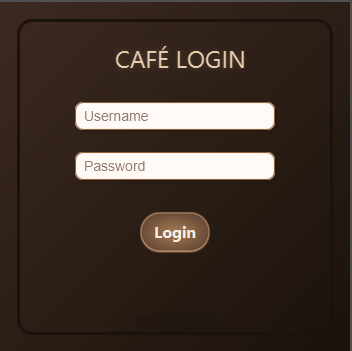
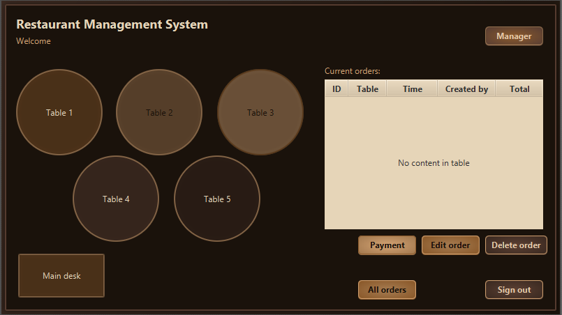
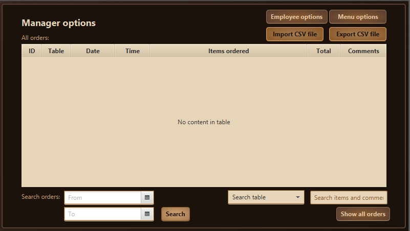
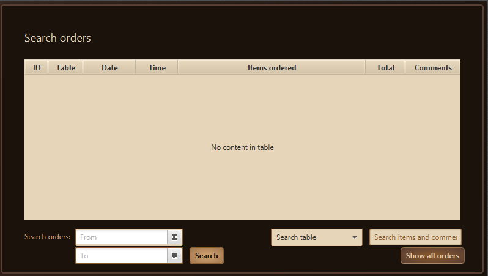
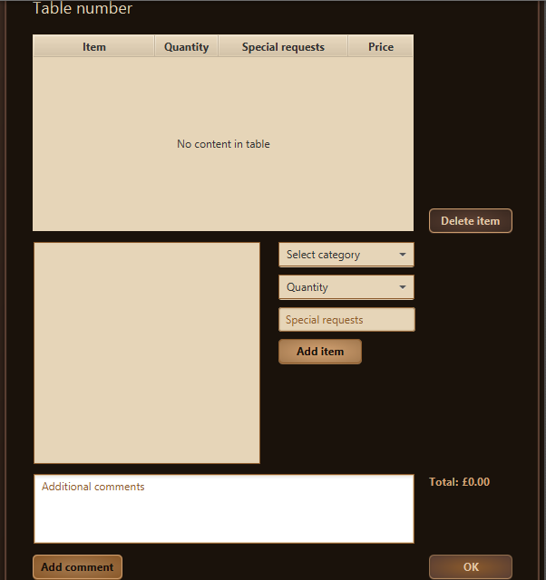
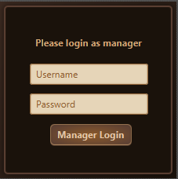
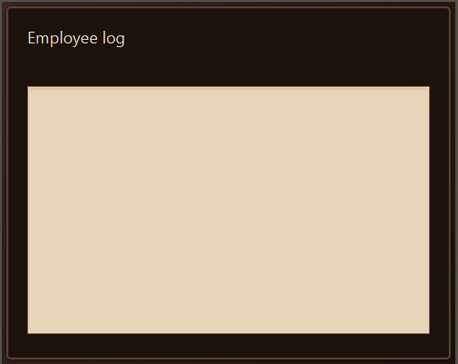
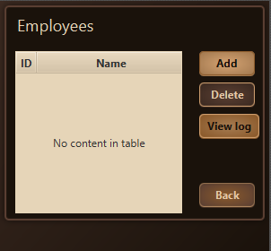
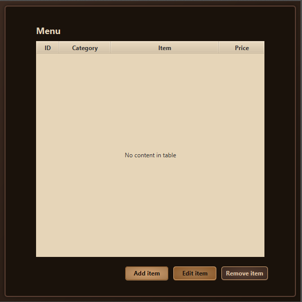
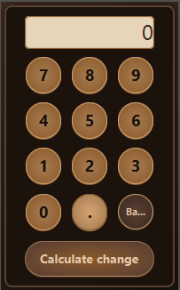

# 🍽️ Restaurant Management System

## 📌 Project Overview
This project is a **Java-based desktop application** developed as part of the **Advanced Object-Oriented Programming (OOP) course**.  
It helps restaurant owners **manage their business operations efficiently**, including menu management, sales tracking, customer records, and order processing.  
The application uses **Java for backend logic**, **JavaFX for the graphical user interface (GUI)**, and **MySQL for database storage**.

---

## 🚀 Features

### 🔐 Secure Login System
- User authentication with encrypted passwords.
- Only authorized staff and administrators can access the system.
- Easy login/logout session management.

### 🛠 Menu Management
- Add, edit, or delete meals, drinks, and extras from the restaurant's menu.
- Dynamically update the menu and instantly reflect changes in the system.

### 📦 Order Management
- Create new customer orders with item selection and customization options.
- Real-time updates for kitchen and billing departments.
- Search and review past orders by date or customer name.

### 💰 Sales and Invoicing
- Monitor daily, weekly, and monthly sales performance.
- Automatic calculation of order totals, including taxes and discounts.
- Generate printable invoices for each order.

### 📋 Customer Records
- Keep track of returning customers and their order history.
- Use past data to improve service quality and personalized offers.

---

## 🛠 Tech Stack
- **Programming Language:** Java (OOP principles)
- **Frontend:** JavaFX (Modern GUI design)
- **Backend:** Java (Core logic, event handling)
- **Database:** MySQL (Entity Relationship Model for data management)
- **Tools:** Scene Builder (for FXML UI design), JDBC for database connection

---

## 📂 Project Structure

---

## ⚙️ System Design

### 📌 UML Diagram
- Shows the system's main classes:
  - User, MenuItem, Order, BillingModule
- Demonstrates the interactions between backend components.

### 📌 Entity-Relationship Diagram (ERD)
- Defines relationships between:
  - Customers, Orders, Menu Items, and Payments.
- Optimized for **efficient data retrieval and management**.

---

## 🎯 Future Enhancements
- Add **multi-user roles** (Admin, Waiter, Kitchen Staff).
- Implement **real-time notifications** for kitchen order updates.
- Export reports (PDF, Excel) for daily and monthly sales.
- Support multi-language interface (English, Arabic).

---

# 💻 UI Preview

---

## 📌 Conclusion
The **Restaurant Management System** provides an **efficient and user-friendly platform** for handling restaurant operations,  
allowing owners to **manage menus, track sales, process orders, and maintain customer records** seamlessly.  
Built using **Java, JavaFX, and MySQL**, this project showcases strong **OOP principles and database-driven application development**.

